# 🚀 ProjectHub

> A modern platform for students and developers to discover projects, explore datasets, and find the right teammates for their next idea.

ProjectHub is a full-stack web application designed to bring project discovery, dataset exploration, developer profiles, and team building into one platform.

Whether you're looking for inspiration for your next project, searching for datasets, or trying to find people with complementary skills, ProjectHub provides everything in one place.

---

## 🌐 Live Demo

### 🔗 ProjectHub

https://project-i1v5g7x0y-sivabadetis-projects.vercel.app

### ⚙️ Backend API

https://projecthub-backend-phsx.onrender.com

---

# 📸 Screenshots

## 🏠 Home Page

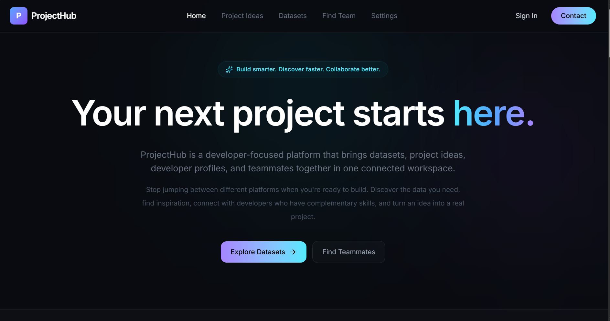

## 🔐 Login

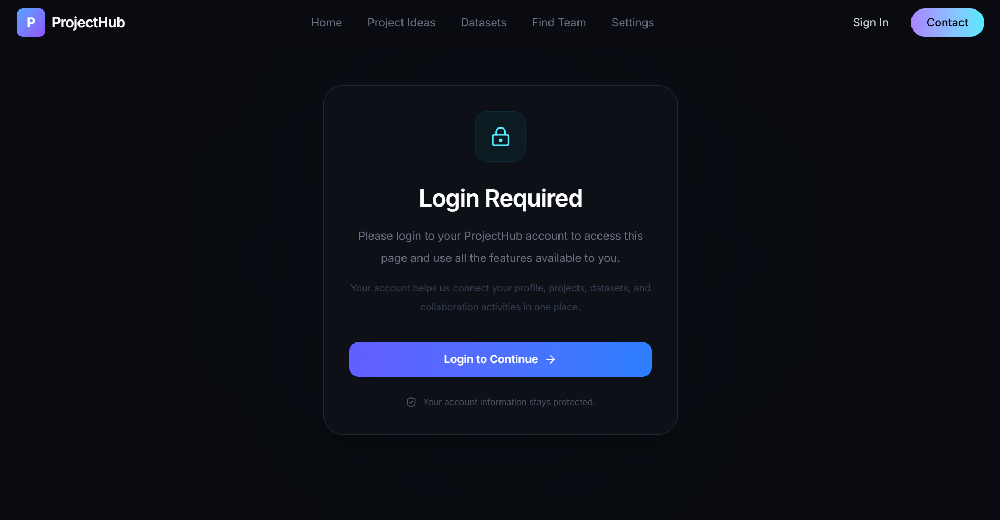
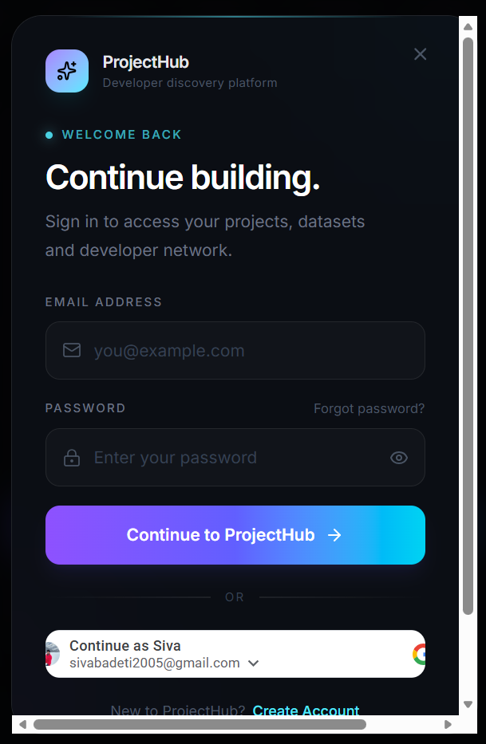

## 📝 Register

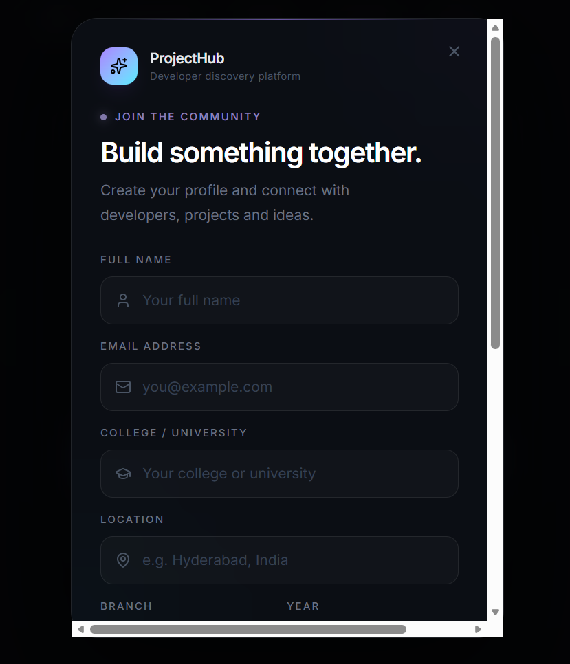

## 💡 Projects

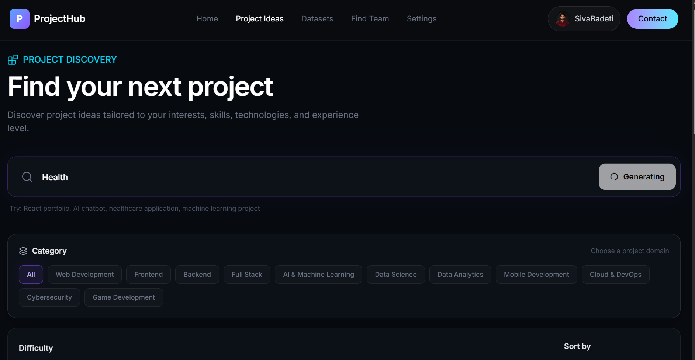
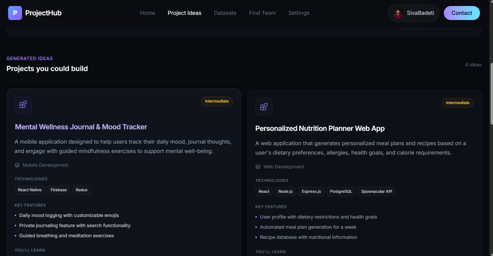


## 📊 Datasets

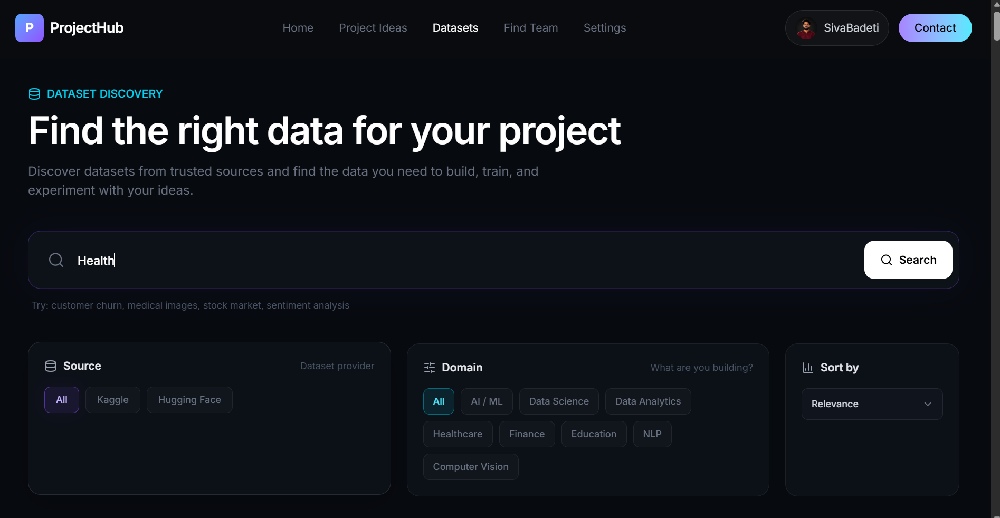
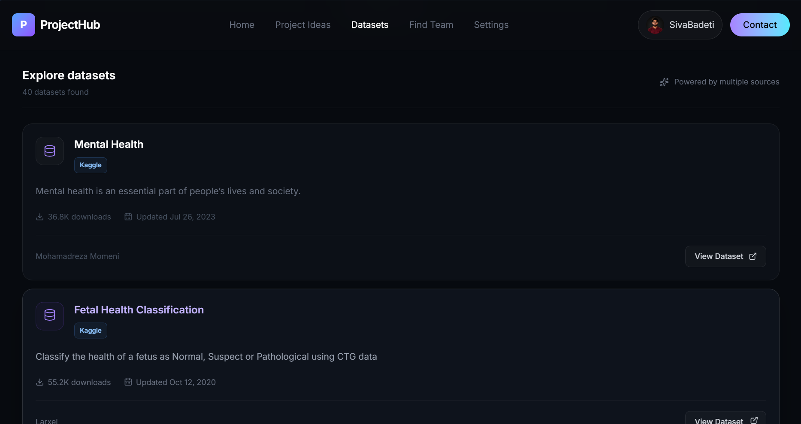

## 👥 Find Teammates

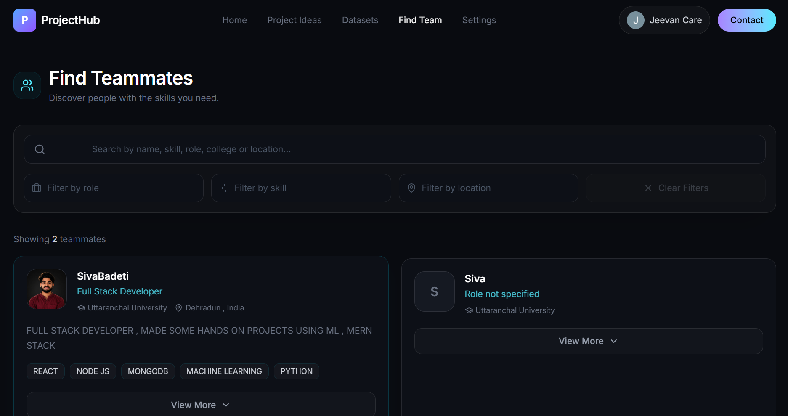
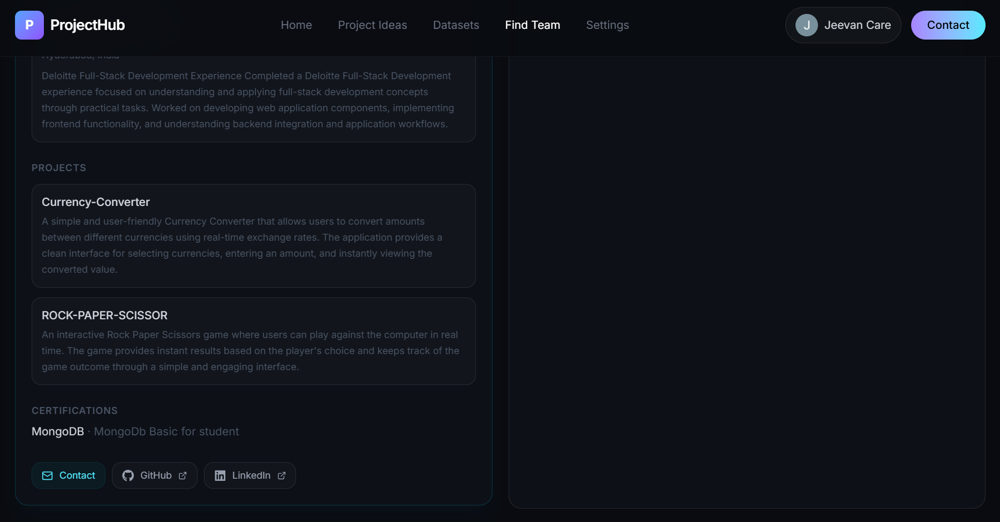

## 👤 Profile

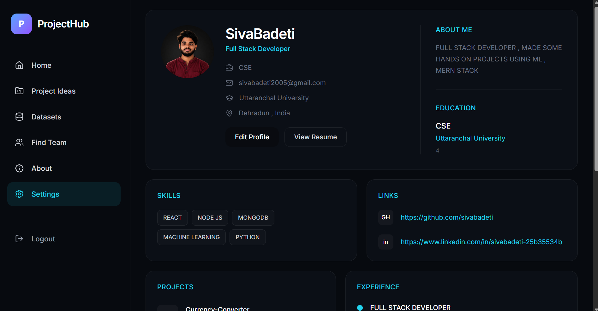

## ✏️ Edit Profile

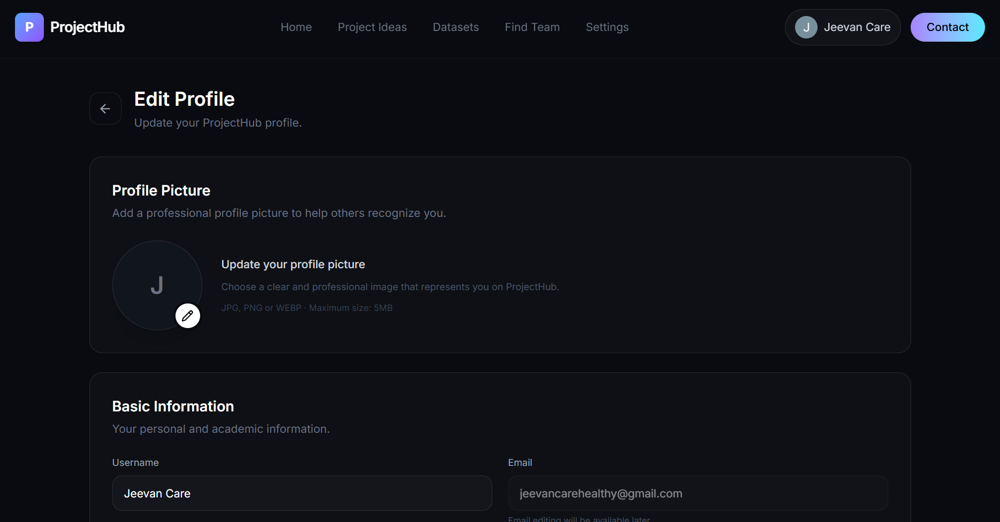

---

# ✨ Features

## 🔐 Authentication

ProjectHub provides a complete authentication system.

- User registration
- Email and password login
- Google authentication
- JWT-based authentication
- Protected routes
- Persistent login sessions
- Login-required page for protected features

---

## 👤 User Profiles

Users can create and manage their professional profiles.

Profile information includes:

- Full name
- Email
- College / University
- Branch
- Academic year
- Location
- Skills
- About section
- Resume
- Profile picture

Users can also update their profile information whenever required.

---

## 💡 Project Discovery

ProjectHub helps users discover project ideas based on their interests.

Users can:

- Search for projects
- Filter projects by category
- Filter projects by difficulty
- Explore project ideas
- Find projects based on their requirements

The project search system is connected to the backend and uses API-based search functionality.

---

## 📊 Dataset Discovery

Finding the right dataset is an important part of machine learning and data science projects.

ProjectHub provides dataset discovery functionality where users can:

- Search for datasets
- Search using different sources
- Filter datasets by domain
- Sort search results
- Explore datasets for different project requirements

Kaggle API integration is used for dataset-related functionality.

---

## 👥 Find Teammates

Finding suitable teammates can be difficult when starting a project.

ProjectHub allows users to discover other developers and students based on information available in their profiles.

Users can search and explore:

- Names
- Roles
- Skills
- Colleges
- Locations
- Branches
- About sections

This helps users find people with relevant skills for their projects.

---

## 🤖 AI Integration

ProjectHub integrates AI-powered functionality using the Gemini API.

AI can be used to improve project discovery and provide intelligent assistance within the platform.

The application is designed to combine traditional search functionality with AI-powered features.

---

## 📁 File Uploads

ProjectHub supports file uploads for user profiles.

### Resume

Supported format:

```text
PDF
